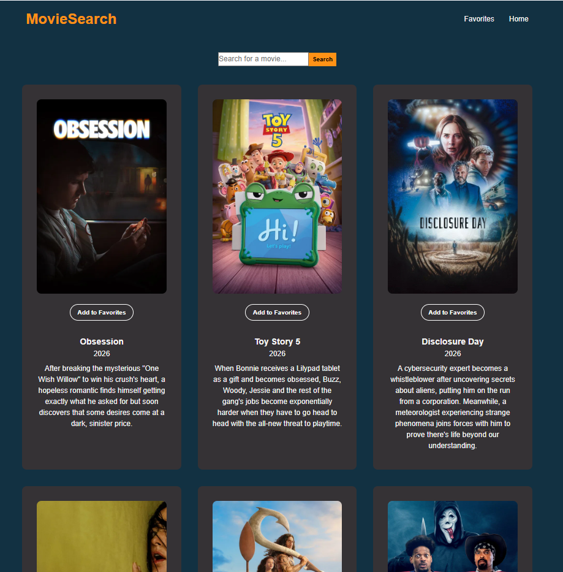
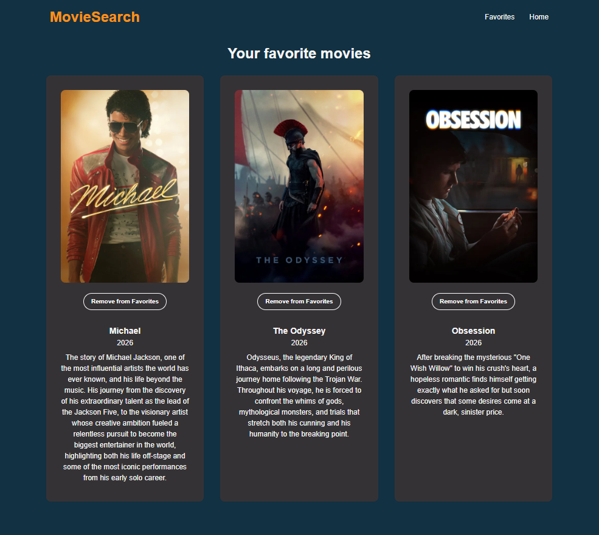

# Movie Search App 

A basic React project created for learning purposes - built to practice fundamental React concepts.

The application connects to a movie API that allows users to search for movies and add selected movies to a favorites list.

## Screenshots

### Home Page



### Favorites Page



## Features

- Search movies using an external API
- Display movie results
- Add movies to favorites
- Remove movies from favorites

## Setup

Create a new Vite React project:
```bash
npm create vite@latest
```

Navigate into the project:
```bash
cd frontend
```

Install dependencies:
```bash
npm install
```

Start the development server:
```bash
npm run dev
```

Install React Router:
```bash
npm install react-router-dom
```
